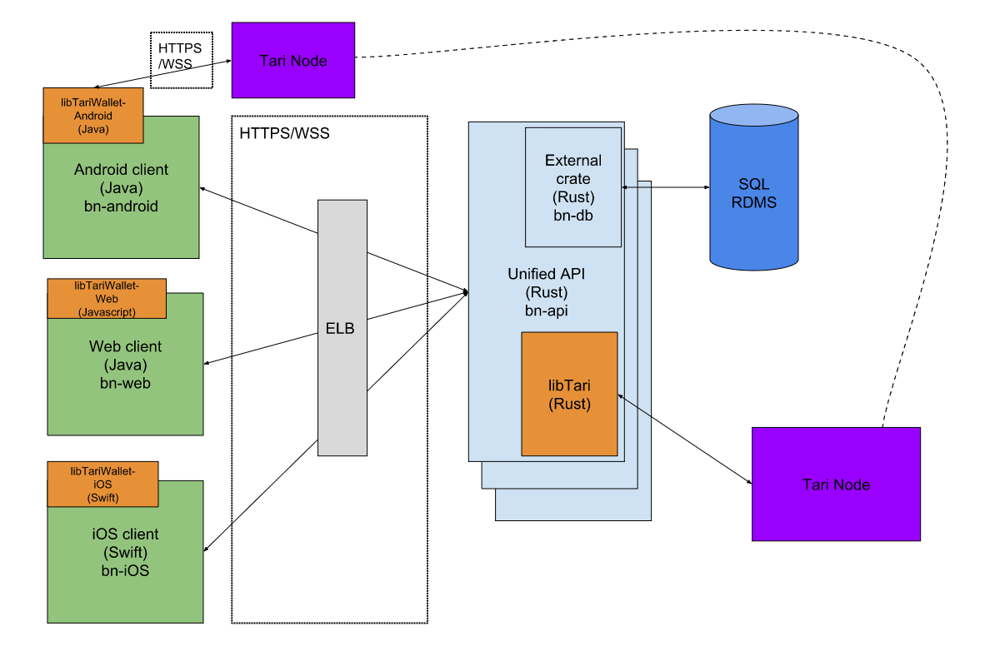

# Big Neon Overall Architecture

Big Neon will be broadly split into a 3-tier architecture.

## Data Layer

### Metadata

On the data layer, we have a SQL RDMS holding non-blockchain-related data and a facade library to convert queries 
to/from library calls. The facade is implemented as a Rust library. 

There is a single RDMS cluster. The majority of queries to the DB will be reads (since the DB mostly holds slow-changing 
& infrequently updated user PII data and not ticket state) with some writes. RDMS are optimised to handle this case, 
with the caveat that the database is properly designed and indices optimised accordingly.

The database needn't be a "dumb" data layer. Many administrative functions, such as role-based permissions, conditional
triggers and automatic table updates can and should be implemented here where it makes sense to improve performance and 
lighten the load on the API layer. 

Any remaining business logic can reside in the associated Rust library which acts as the primary broker of information between
the DB itself and the API.

A gRPC interface can be developed to allow non-Rust
applications from accessing the Big Neon database, but this is not a core requirement presently.

### Ticket data

Analogously, A Rust library, `libtari` that acts as a translation layer to a Tari Node provides a nice UX for converting node queries 
to something resembling “traditional” API calls. We will assume that the Tari Network can handle requests of up to 100,000 tps, 
and that transaction confirmations are effectively instantaneous (but asynchronous), and that a Tari node can handle 
similar traffic from multiple connected clients.

`libtari` abstracts away much of the blockchain-specific effort that one doesn't find in a traditional DB, such as
signing transactions and verifying messages. In other respects, a Tari node looks much like a traditional DB. You can
request state (Read) from a node (e.g. balance of a set of UTXO keys, or the state of a digital asset) and write state
(Create, Update, Delete) by creating new assets, updating state / spending coins, or expiring assets. From a UX perspective, 
these should look very much like typical CRUD calls. `libtari` will be responsible for returning the relevant data or
crafting the appropriate transaction to change asset state or spend UTXOs.   

## API layer

On the business logic layer we have the Unified Big-Neon API that communicates with the clients and the data layer. 
The API uses REST/WSS to communicate with clients. Since all back-end code is written in Rust, the DB and Tari node 
communication can be done by including the `bn-db` Rust library and `libTari` crates.  

The API scales horizontally when demand increases, with a load balancer forwarding requests to the API instances.

An interesting note is that the API cannot cannot rely on cached state with respect to Tari Digital Assets, since 
clients can by design, bypass the API and communicate directly with the Tari blockchain to effect many types of 
transactions. However we can assume that updates to Tari digital asset (TDA) state will be communicated eventually 
(usually near-instantly) from the node that the API is connected to. 

This also means that the API does not have to transmit updates about TDAs back to clients, since the wallet libraries 
will pick these up from the nodes that they are connected to.

The API will however serve and non-blockchain data such as event media and metadata, user account info, and so on to minimise
latency.

The API's core function is to 
* validate and sanitise input from connected clients and pass that data onto the data layer
* Receive data from the data layer, parse it into a format suitable for the client receiving it, and pushing that data 
  over the wire
  
By and large, the API is a translation layer rather than a business logic layer.  
The API will also be be able to implement performance optimisations, such as caching and data aggregation.   

## Client layer

On the client layer, we have the following general arrangement:

* A Tari wallet library that can communicate directly with nodes to do basic wallet transactions (getBalance, see ticket 
  info, transfer, redeem etc). This is a backend service and we will need to write one for each platform we support. 
  The wallet library basically provides the same functionality that `libtari` does.
* A dumb UI client that translates calls from users to the Big Neon API and the user wallet. 

Three clients are drawn here, but there will be more: a bouncer client, promoter “admin” web clients etc., but the same general arrangement applies.

# Code organisation

The architectural layout as presented allows us to split the Big Neon codebase into several independent projects, each within their own repo:

* Every client lives in its own repo (bn-[arch]).
* Every client wallet library gets its own repo (lib-tariwallet-[arch]). Long-term, these codebases should live in the 
tari-project org since they have nothing to do with Big Neon per se, but until the protocol APIs have stabilised, 
they can live in the Big Neon org for now.
* The unified Big Neon API lives in its own repo (bn-api)
* The Big Neon DB management (via ORM) and business logic layer lives in a single repo (bn-db)
* `libtari` has its own repo (libTari). As with the libwallet libraries, this should eventually migrate to the tari-project org.

